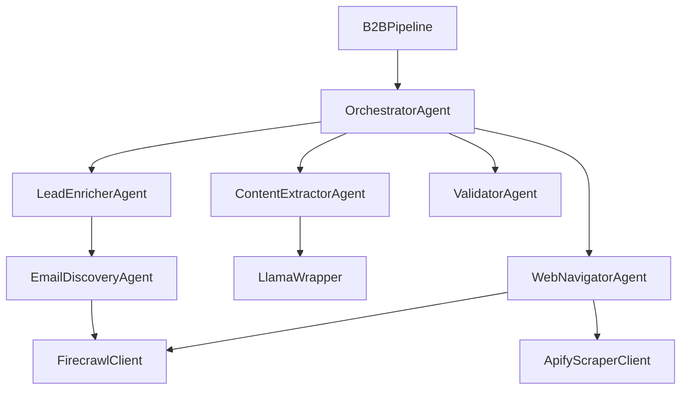

# Architecture Documentation

## System Overview

The B2B Lead Generation Pipeline is an autonomous system designed to discover, scrape, extract, and enrich business professional profiles from the web, with a primary focus on LinkedIn data. It orchestrates a suite of specialized agents to transform a natural language query (e.g., "Sales Managers in Italy") into a structured dataset of high-quality leads containing contact information.

### High-Level Architecture

The system follows a linear pipeline architecture with an overarching orchestrator:

`CLI Entry` -> `Orchestrator (Query Decomposition)` -> `Web Navigator (Discovery & Fetching)` -> `Content Extractor (LLM Extraction)` -> `Lead Enricher (Multi-stage Enrichment)` -> `Validator (Quality Control)` -> `Orchestrator (Aggregation)` -> `JSON Output`

### Technology Stack

- **Language:** Python 3.11+
- **Discovery:** Firecrawl API (v2)
- **Scraping:** Crawl4AI (Playwright-based)
- **Extraction & Inference:** LLM via Ollama (Llama 3 / GPT-OSS models)
- **Data Models:** Pydantic
- **Configuration:** YAML + Dotenv
- **Logging:** Structlog

### Design Principles

1.  **Modularity:** Each stage is handled by an independent agent with clear inputs/outputs.
2.  **Redundancy:** Multiple strategies for discovery and scraping (e.g., Crawl4AI with Firecrawl fallback).
3.  **Resilience:** Comprehensive error handling and partial batch saving prevents total pipeline failure.
4.  **Configurability:** All thresholds, limits, and models are adjustable via `settings.yaml`.

---

## Pipeline Stages

### 1. Discovery (WebNavigatorAgent)
**Purpose:** Find relevant LinkedIn profile URLs based on the user query.
- **Input:** Natural language query (e.g., "CTOs in Berlin").
- **Component:** `agents/web_navigator.py` using `tools/firecrawl_client.py`.
- **Strategy:** Uses Firecrawl to execute a 3-step targeted search (Broad, Specific, Exclusionary).
- **Filtering:** Aggressively filters results to retain only `linkedin.com/in/*` URLs, excluding jobs, posts, and company pages.

### 2. Scraping (WebNavigatorAgent)
**Purpose:** Fetch the raw HTML/Markdown content of the discovered profiles.
- **Input:** List of LinkedIn URLs.
- **Scraping:** Apify LinkedIn Profile Scraper
    *   **Tool:** `tools/apify_client.py` wrapping Apify Client.
    *   **Mechanism:** Uses Apify Actor (oJMZe85C0opC0xcx2) to scrape profiles in batches.
    *   **Output:** Structured JSON converted to Markdown for extraction.
- **Discovery:** Firecrawl
    *   **Tool:** `tools/firecrawl_client.py` wrapping Firecrawl API.
    *   **Mechanism:** Search and discovery of company websites and general validation.
- **Orchestration:** `agents/orchestrator.py`
    *   Decomposes queries into search tasks.
    *   Aggregates results from multiple sources.

### 2.2 Component Hierarchy

### 2.3 Data Flow

1.  **Search:** `WebNavigatorAgent` uses `FirecrawlClient` for initial discovery and `ApifyScraperClient` for targeted LinkedIn profile scraping.
    *   Apify -> 20+ profiles per batch.
    *   Firecrawl -> Domain discovery.
2.  **Extraction:** Scraped content (JSON/Markdown) is passed to `ContentExtractorAgent`.
3.  **Enrichment:** `LeadEnricherAgent` coordinates enrichment.
    *   `EmailDiscoveryAgent` finds emails via multiple strategies.
    *   `LinkedInProfileEnricherAgent` parses existing profile data (no re-scraping).
4.  **Validation:** `ValidatorAgent` normalizes and verifies data.
5.  **Output:** JSON artifacts saved to `artifacts/`.

### 3. Extraction (ContentExtractorAgent)
**Purpose:** Parse unstructured Markdown into structured `LeadProfile` objects.
- **Input:** Raw Markdown content.
- **Component:** `agents/content_extractor.py`.
- **Process:**
    1.  **Detect Content Type:** Classifies content as Profile, Team Page, or Article.
    2.  **Clean:** tailored cleaning logic (e.g., extracting specific LinkedIn sections like About/Experience).
    3.  **Extract:** Uses LLM (Ollama) with type-specific prompts to extract fields.
    4.  **Fallback:** If structured extraction fails, attempts minimal extraction (Name/Company only).

### 4. Enrichment (LeadEnricherAgent)
**Purpose:** Augment lead data with missing contact info and standardized fields.
- **Component:** `agents/lead_enricher.py`.
- **Stages:**
    1.  **LinkedIn Scrape (Overlay):** Attempts to fetch contact info overlays if accessible.
    2.  **Domain Discovery:** Finds company website domain (`CompanyDomainAgent`).
    3.  **Email Discovery:** Crawls company website to find email patterns (`EmailDiscoveryAgent`).
    4.  **Inference:** Uses LLM to infer missing fields from existing context if high confidence.
    5.  **Deduplication:** Removes duplicates based on Email, LinkedIn URL, or normalized Name+Company.

### 5. Validation (ValidatorAgent)
**Purpose:** Ensure data quality and normalize formats.
- **Component:** `agents/validator.py`.
- **Checks:** Validates Email syntax, Phone numbers (E.164 normalization), and URL formats.
- **Scoring:** Calculates a `quality_score` (0.0-1.0) based on field completeness and validation success.

### 6. Aggregation & Output
**Purpose:** Compile final results and save artifacts.
- **Component:** `pipelines/b2b_lead_pipeline.py`.
- **Output:** JSON file in `artifacts/` containing the `LeadBatch` data and run statistics.

---

## Data Flow

1.  **User > CLI:** `python pipelines/b2b_lead_pipeline.py "CTO Berlin"`
2.  **Orchestrator:** Parses query -> `TaskPlan` (search terms: "CTO Berlin", "Chief Technology Officer Berlin").
3.  **WebNavigator:**
    *   Executes Firecrawl search -> 100+ raw URLs.
    *   Filters -> 50 valid LinkedIn Profile URLs.
    *   Crawl4AI -> 50 Markdown documents.
4.  **ContentExtractor:** Processing 50 docs -> 45 `LeadProfile` objects (structured).
5.  **LeadEnricher:**
    *   Lead A (missing domain) -> Search "Company X domain" -> updates Lead A.
    *   Lead A (missing email) -> Crawl "company-x.com" -> updates Lead A.
    *   Deduplicates 45 leads -> 42 Unique Leads.
6.  **Validator:** Checks 42 leads -> 40 Valid High-Quality Leads.
7.  **Output:** Saves `pipeline_{id}_complete.json`.

---

## Component Reference

### OrchestratorAgent (`agents/orchestrator.py`)
- **`decompose_query(user_query)`**: Uses LLM to break down a user request into specific search queries and target fields.
- **`coordinate_enrichment(leads)`**: Manages the multi-stage enrichment process with time budget handling.

### WebNavigatorAgent (`agents/web_navigator.py`)
- **`search_and_fetch(query)`**: Main entry point. Optimizes query, executes search, and fetches content.
- **`_fetch_with_crawl4ai(urls)`**: Primary fetch method using authenticated browser.
- **`_filter_linkedin_profile_urls(urls)`**: regex-based filtering to ensure only profile URLs are processed.

### FirecrawlClient (`tools/firecrawl_client.py`)
- **`discover_linkedin_profiles(role, location, ...)`**: Implements the 3-step search strategy.
- **`batch_scrape(urls)`**: Fallback scraping method.

### ContentExtractorAgent (`agents/content_extractor.py`)
- **`extract_entities(markdown, schema)`**: Main extraction logic with fallbacks.
- **`_extract_linkedin_sections(markdown)`**: specialized parser for LinkedIn profile structure.

### LeadEnricherAgent (`agents/lead_enricher.py`)
- **`infer_missing_fields(lead)`**: Driver for enrichment logic.
- **`deduplicate_leads(leads)`**: Smart deduplication logic.

---

## Firecrawl Discovery Strategy

The pipeline maximizes discovery using a sophisticated 3-step query approach in `FirecrawlClient.discover_linkedin_profiles`:

1.  **Broad Search:** `{role} {location} site:linkedin.com/in/`
    *   Goal: Capture the widest net of candidates.
2.  **Specific Search:** `{role} {location} {skills} site:linkedin.com/in/`
    *   Goal: Find candidates matching specific niche criteria (if skills provided).
3.  **Exclusionary Search:** `{role} {location} {exclusions} site:linkedin.com/in/`
    *   Goal: Find candidates that might have been buried by dominant keywords in broad search.

**Limits:**
- Each step requests up to `limit_per_step` (default 50) URLs.
- Total potential discovery: 3 * 50 = 150 URLs per base query.
- The pipeline `max_results` setting controls how many *final profiles* are processed, but discovery is always aggressive to ensure quality selection.

---

## Authentication & Account Management

The pipeline uses `tools/account_manager.py` (referenced by Crawl4AI client) to manage LinkedIn sessions.

- **State Storage:** Session cookies are stored in `.auth/storage_states/*.json`.
- **Loading:** `Crawl4AIClient` loads these states to authenticate the browser context.
- **Rotation:** If multiple accounts are configured, the system can rotate between them to distribute request load (though standard mode uses a single primary account).
- **Safety:** The system automatically excludes the authenticated user's own profile URL (configured in `settings.yaml`) to prevent self-scraping loops.

---

## Configuration Guide (`config/settings.yaml`)

| Section | Parameter | Description |
| copy | --- | --- |
| `models` | `ollama_host` | URL of the local Ollama instance. |
| `crawling` | `max_concurrent` | Max parallel browser tabs for scraping. |
| `linkedin` | `auth_enabled` | Enable/Disable authenticated scraping. |
| `linkedin` | `authenticated_user_url` | Your own profile URL (to exclude). |
| `extraction` | `confidence_threshold` | Min score (0.0-1.0) to keep a lead. |

---

## Logging & Monitoring

Logs are structured (JSON/Text) and printed to console.
- **Level:** INFO by default, DEBUG available via `--verbose`.
- **Key Events:**
    - `Executing search query`: Discovery started.
    - `Found pages`: Number of URLs discovered.
    - `Structured extraction successful`: A lead was successfully parsed.
    - `Lead enrichment completed`: Summary of enrichment stats.

**Error Handling:**
- The pipeline uses a `LeadBatch` wrapper. If errors occur, it attempts to return a partial batch with `partial: True` metadata.
- Artifacts are saved at every major stage (e.g., `_pipeline_failed_partial.json`) to minimize data loss.
